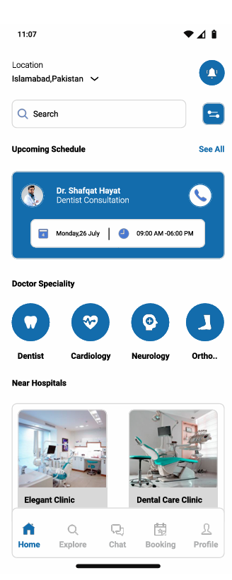
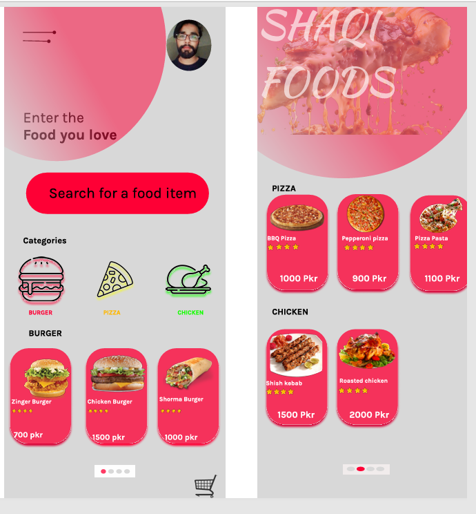
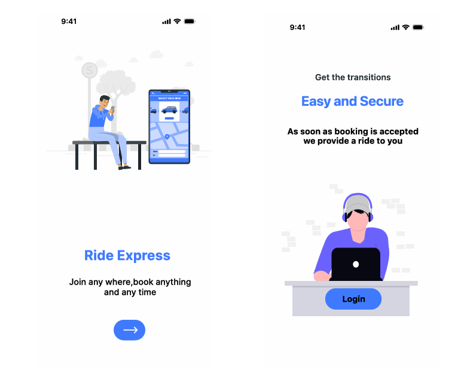
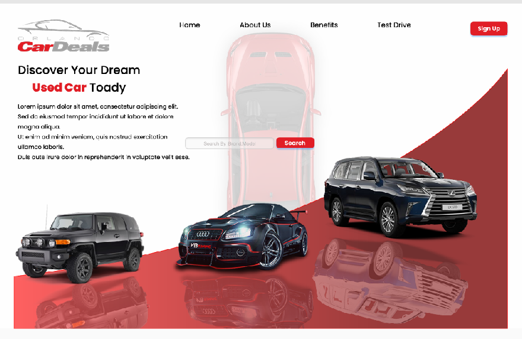
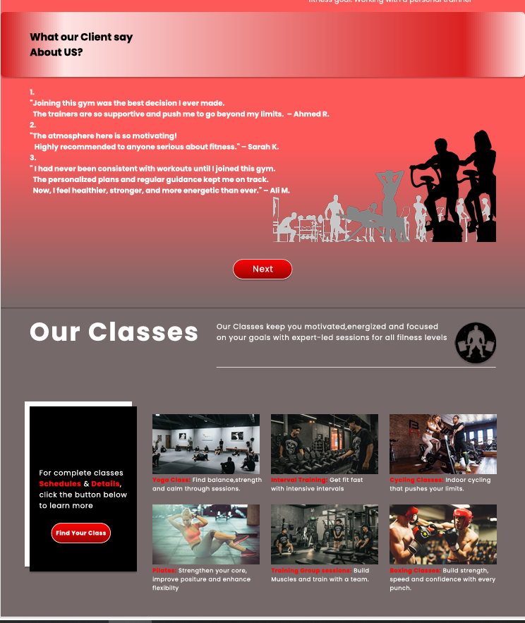

# 🚀 Shafqat Hayat | Software Engineering Portfolio

Welcome to my professional portfolio repository. I am a **Software Engineering student (BSSE)** specializing in building high-performance web interfaces and bridging the gap between technical architecture and user-centric design.

## 🎓 About Me
* **Current Focus:** Pursuing a Bachelor of Science in Software Engineering (BSSE) at International Islamic University Islamabad.
* **Professional Goal:** Architecting digital solutions through engineering principles, with a specific focus on business automation and modern UI/UX.
* **Experience:** Includes UI/UX design at DTC Software House and developing technical management systems for local business operations.

## 🛠️ Technical Skills
* **Web Development:** HTML5, Tailwind CSS, and JavaScript.
* **Design Tools:** Figma, Adobe XD, and Photoshop.
* **Version Control:** Expert use of GitHub for deployment and project management.
* **Languages:** Fluent in English, Urdu, and Punjabi.

## 📸 Project Gallery
Below are visual highlights of the projects currently featured in this repository:

### 📱 UI/UX & Figma Designs
| **Doctor Appointment App** | **Shaqi Food App** | **Ride Express** |
| :---: | :---: | :---: |
|  |  |  |

| **Luxury Car Booking** | **Super Market UI** | **Gym Website** |
| :---: | :---: | :---: |
|  |  |  |

### 🌐 Web Interface
* **Portfolio Hero Section:**
    

## 📂 Repository Contents
* `index.html`: Main portfolio code built with Tailwind CSS.
* `*.pdf`: Full design case studies for each mobile application.
* `*.png`: High-resolution assets and project previews.

## 📬 Contact Information
* **Email:** shafqathayat.dev@gmail.com
* **Phone:** +92 3318156210

---
